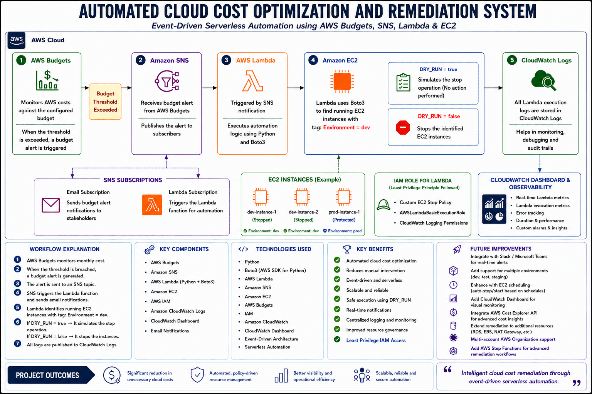

# Architecture

## Solution Architecture Diagram



---

# Automated Cloud Cost Optimization and Remediation System

## Architecture Overview

This project implements an event-driven serverless cloud cost optimization system on AWS that automatically detects budget threshold breaches and triggers remediation actions on tagged EC2 instances.

The architecture combines AWS Budgets, Amazon SNS, AWS Lambda, Amazon EC2, CloudWatch Logs, and CloudWatch Dashboard to create a scalable, automated, and production-style cost governance workflow.

The solution follows modern cloud engineering principles including:

- Event-driven automation
- Serverless architecture
- Least privilege IAM access
- Observability and monitoring
- Environment-aware remediation
- Automated operational governance

---

# End-to-End Workflow

## 1. AWS Budgets Monitoring

AWS Budgets continuously monitors cloud spending against a configured monthly budget threshold.

When the defined threshold is exceeded, AWS Budgets automatically generates a budget alert event.

### Purpose

- Cost monitoring
- Budget governance
- Automated alert generation

---

## 2. Amazon SNS Notification System

The budget alert is sent to an Amazon SNS topic.

SNS acts as the messaging and notification layer of the architecture.

### SNS Subscribers

### Email Subscription

Sends budget breach notifications to stakeholders and administrators.

### Lambda Subscription

Triggers the remediation Lambda function automatically.

### Benefits

- Decoupled architecture
- Real-time notifications
- Scalable event distribution

---

## 3. AWS Lambda Automation Layer

AWS Lambda acts as the core remediation engine of the system.

The Lambda function is triggered automatically through the SNS notification and executes Python-based automation logic using Boto3.

### Lambda Responsibilities

- Parse SNS budget alerts
- Identify running EC2 instances
- Filter instances using tags
- Perform remediation actions
- Publish execution logs to CloudWatch

### Technologies Used

- Python
- Boto3 (AWS SDK for Python)
- AWS Lambda Runtime

---

## 4. EC2 Environment-Aware Remediation

The Lambda function scans for EC2 instances tagged with:

```text
Environment = dev
```

Only development instances are targeted for remediation actions.

Production instances remain protected from automated shutdown operations.

### DRY_RUN Safety Mechanism

The project includes a configurable DRY_RUN parameter for safe testing.

### DRY_RUN = true

- Simulates remediation
- No instances are stopped
- Used for validation and testing

### DRY_RUN = false

- Executes actual stop operation
- Stops identified EC2 instances
- Performs real remediation

### Benefits

- Safe automation testing
- Reduced operational risk
- Production-safe implementation

---

# IAM Security Architecture

The Lambda function follows the Least Privilege Principle.

The IAM role includes only the required permissions necessary for remediation and logging.

### IAM Permissions

- Custom EC2 Stop Policy
- AWSLambdaBasicExecutionRole
- CloudWatch Logging Permissions

### Security Benefits

- Reduced attack surface
- Controlled automation access
- Secure operational design

---

# CloudWatch Logging and Observability

All Lambda execution logs are published to Amazon CloudWatch Logs.

A CloudWatch Dashboard is used to provide centralized monitoring and observability for the automation workflow.

### Dashboard Monitoring

- Real-time Lambda metrics
- Lambda invocation metrics
- Error tracking
- Duration and performance monitoring
- Custom alarms and insights

### Benefits

- Centralized observability
- Easier debugging
- Operational visibility
- Monitoring and auditing

---

# Key AWS Services Used

| Service | Purpose |
|---|---|
| AWS Budgets | Cost monitoring and alerting |
| Amazon SNS | Event notification system |
| AWS Lambda | Serverless remediation automation |
| Amazon EC2 | Target resource for remediation |
| Amazon CloudWatch | Logging and monitoring |
| IAM | Secure access management |

---

# Architecture Highlights

## Event-Driven Automation

The entire workflow is automatically triggered based on budget threshold events.

## Serverless Design

The architecture uses AWS Lambda for scalable and infrastructure-free execution.

## Environment-Aware Governance

Only tagged development resources are targeted, protecting production workloads.

## Observability Focused

CloudWatch dashboards and logs provide operational visibility and monitoring.

## Security Best Practices

Least privilege IAM permissions ensure secure remediation execution.

## Cost Optimization

Unused development resources can be automatically stopped to reduce cloud expenditure.

---

# Future Improvements

The architecture can be extended further using advanced AWS services and enterprise-level enhancements.

### Planned Enhancements

- Slack / Microsoft Teams integration
- Multi-environment support (dev, test, staging)
- EC2 scheduling automation
- Advanced CloudWatch dashboards
- AWS Cost Explorer API integration
- Multi-account AWS Organization support
- AWS Step Functions orchestration
- Additional resource remediation support
  - RDS
  - EBS
  - NAT Gateway

---

# Project Outcomes

- Automated cloud cost optimization
- Reduced manual operational effort
- Improved governance and monitoring
- Scalable serverless automation
- Better visibility into cloud operations
- Production-style remediation workflow

---

# Conclusion

This architecture demonstrates how event-driven serverless automation can be used to implement intelligent cloud cost governance on AWS.

By combining AWS Budgets, SNS, Lambda, EC2, IAM, and CloudWatch, the solution provides a secure, scalable, and observable remediation system capable of automatically optimizing cloud infrastructure costs.
