# Implementation Walkthrough

## Step 1 – SNS Topic Creation

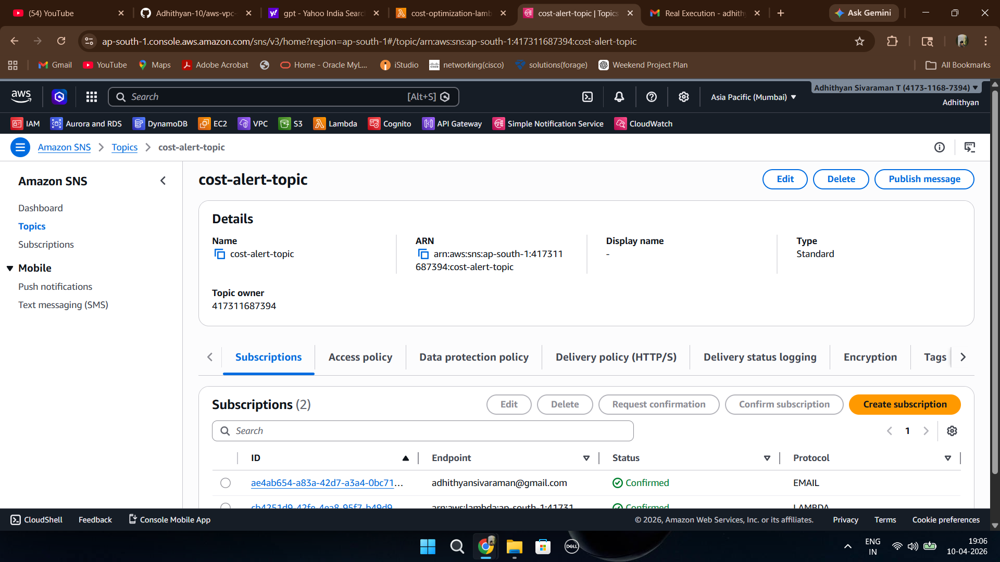

An Amazon SNS topic named `cost-alert-topic` was created for handling budget alert notifications.  
This SNS topic acts as the communication bridge between AWS Budgets and Lambda automation.

---

## Step 2 – SNS Subscription Configuration

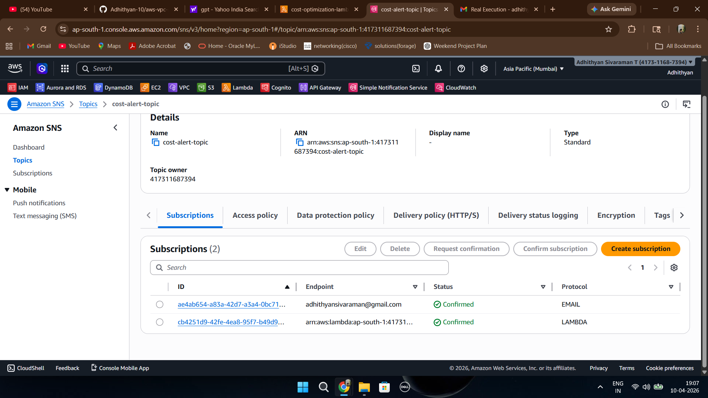

Two subscriptions were configured for the SNS topic:
- Email subscription
- Lambda subscription

The email subscription sends notifications to the administrator, while the Lambda subscription automatically triggers the Lambda function.

---

## Step 3 – Lambda Function Overview

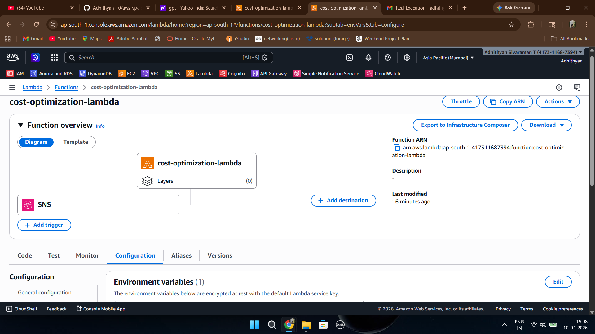

A Lambda function named `cost-optimization-lambda` was created.  
Amazon SNS was added as the trigger source so the function executes automatically whenever budget alerts are generated.

---

## Step 4 – Lambda Function Code

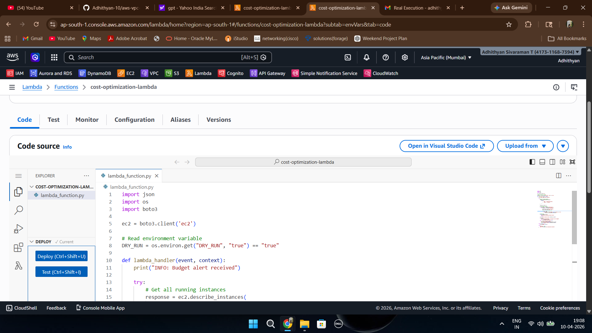

The Lambda function was written using Python and Boto3.  
The code identifies running EC2 instances and automatically stops them whenever the configured budget threshold is exceeded.

---

## Step 5 – Lambda Environment Variables

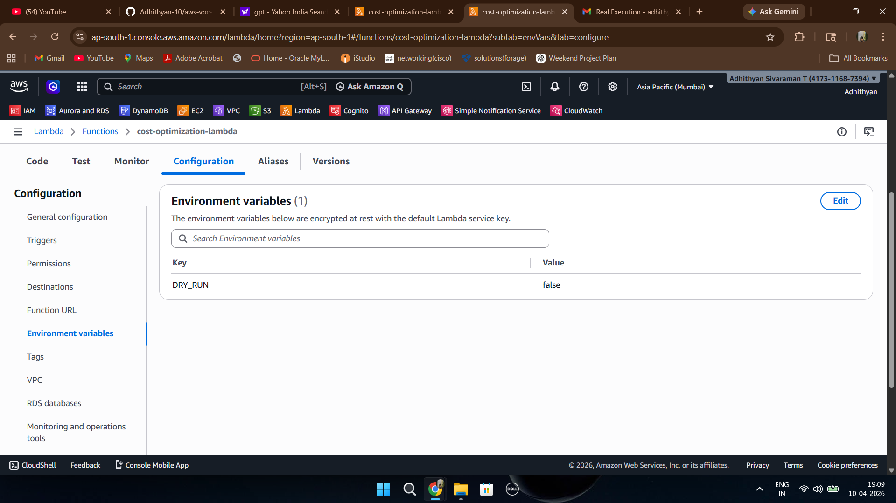

An environment variable named `DRY_RUN` was configured inside the Lambda function.  
This variable helps switch between safe testing mode and real execution mode.

---

## Step 6 – IAM Role Permissions

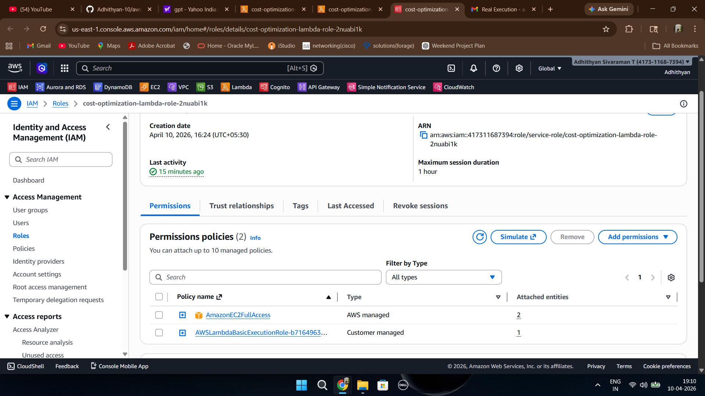

An IAM role with EC2 and Lambda execution permissions was attached to the Lambda function.  
These permissions allow Lambda to describe and stop EC2 instances and write logs to CloudWatch.

---

## Step 7 – EC2 Instance Creation

An EC2 instance was launched for testing the automation workflow.  
The instance was running before the budget-triggered automation was executed.

---

## Step 8 – EC2 Resource Tagging

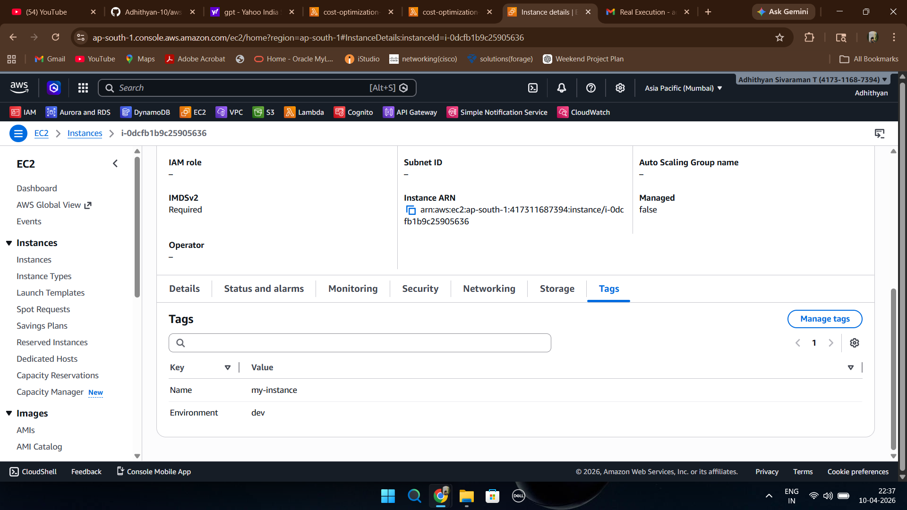

Tags such as `Name` and `Environment` were configured for the EC2 instance.  
Resource tagging helps organize infrastructure and manage automation more efficiently.

---

## Step 9 – SNS Publish Message Test

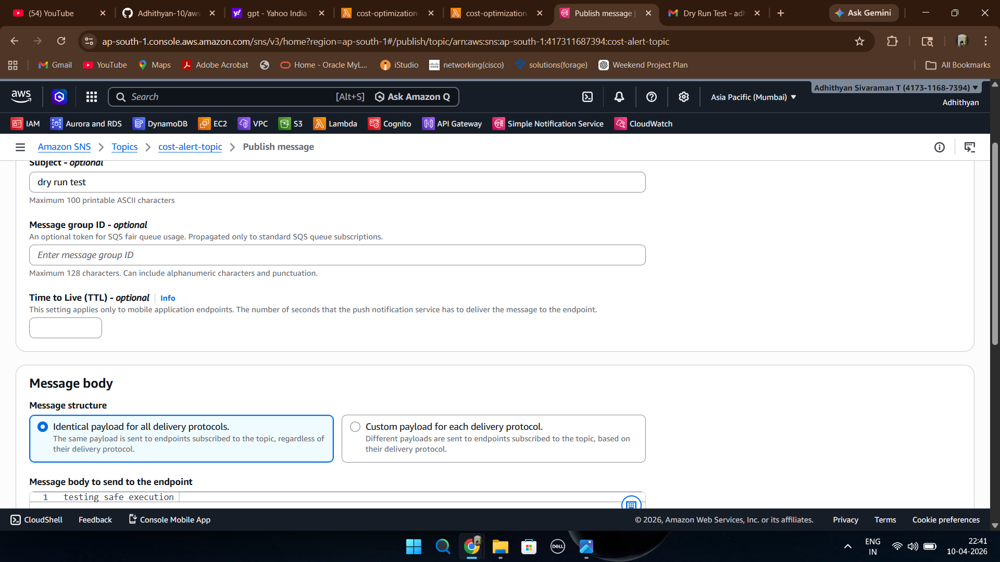

A manual SNS message was published to test the complete workflow.  
This triggered both email notifications and Lambda execution successfully.

---

## Step 10 – CloudWatch Logs (Dry Run)

.png)

The Lambda function was initially tested in Dry Run mode.  
The logs confirmed that the EC2 instance was detected successfully without actually stopping it.

---

## Step 11 – CloudWatch Logs (Real Execution)

.png)

After successful validation, Dry Run mode was disabled for real execution testing.  
The logs confirm that Lambda successfully stopped the running EC2 instance.

---

## Step 12 – EC2 Instance Stopped

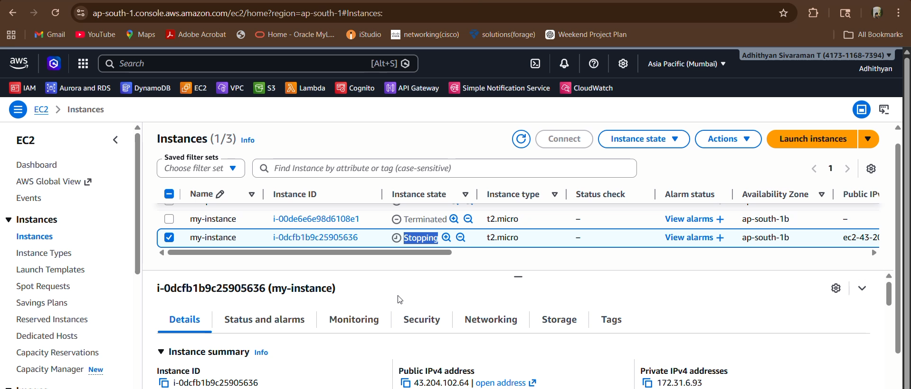

After Lambda execution, the EC2 instance entered the `Stopping` state.  
This confirms that the automation workflow successfully performed the cost optimization action.

---

## Step 13 – CloudWatch Log Group

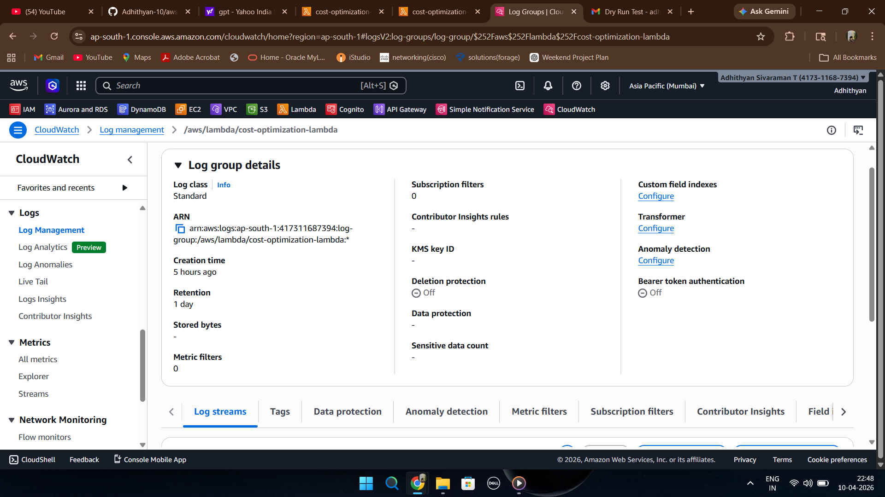

CloudWatch automatically created log groups for the Lambda function.  
These logs help monitor execution status and troubleshoot issues during automation.

---

## Step 14 – AWS Budget Creation

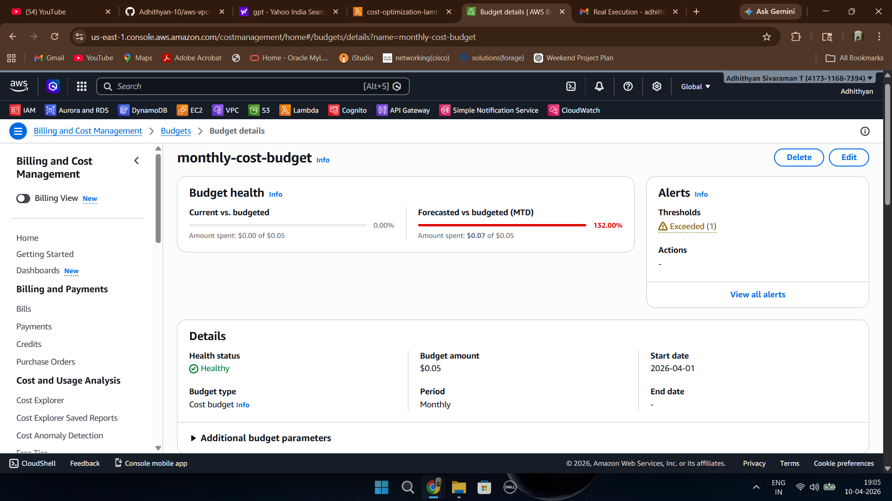

An AWS Cost Budget named `monthly-cost-budget` was created with a low threshold value.  
The budget continuously monitors cloud spending and triggers alerts when limits are exceeded.

---

## Step 15 – Budget Alert Linked with SNS

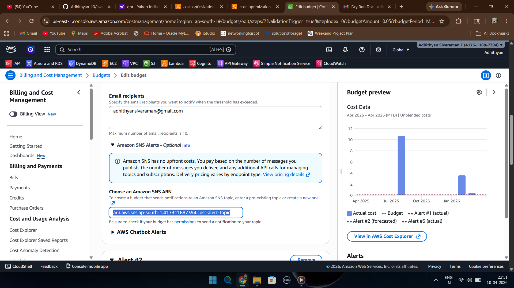

The AWS Budget alert was connected with the SNS topic using the SNS ARN.  
This integration enables automatic notification delivery and Lambda execution whenever the budget threshold is crossed.

---

## Step 16 – Dry Run Email Notification

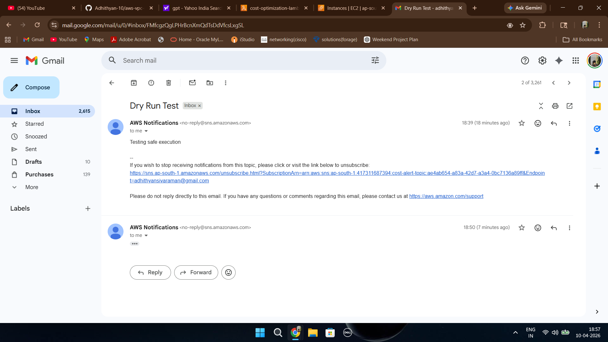

A dry run test email notification was successfully received through SNS.  
This validated the email subscription and notification workflow without stopping EC2 instances.

---

## Step 17 – Real Execution Email Notification

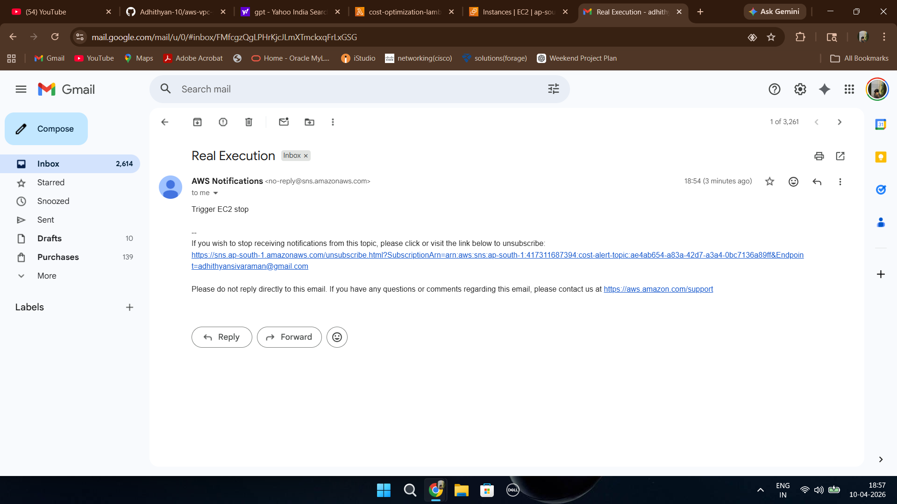

A real execution notification email was received after triggering the automation workflow.  
This confirms successful SNS delivery, Lambda execution, and automated EC2 cost optimization.
