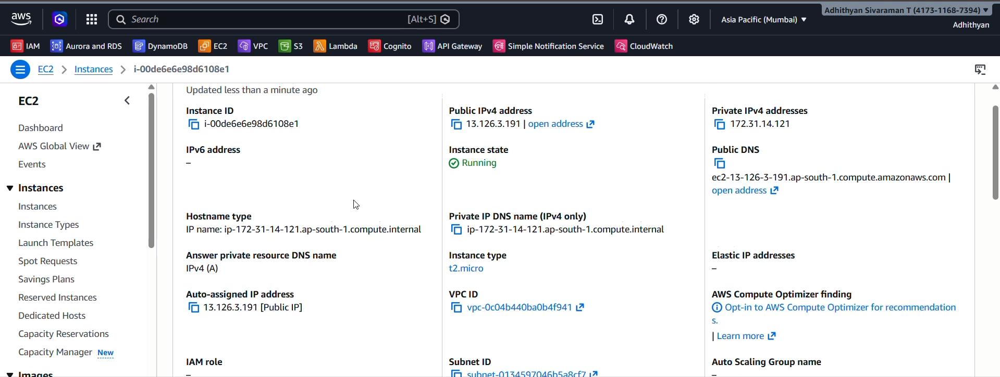

# Implementation Walkthrough

This document provides a complete step-by-step walkthrough of the AWS Automated Cost Optimization and Governance project implementation.

---

# Step 1 — Project Architecture Overview

The architecture demonstrates the complete automation workflow of the project.  
AWS Budgets monitors cloud spending and triggers SNS notifications when thresholds are exceeded.  
SNS invokes Lambda functions that automatically perform EC2 cost optimization actions.

---

# Step 2 — AWS Budget Creation

An AWS Budget was created to monitor monthly cloud spending.  
The configured threshold triggers alerts whenever the estimated cost exceeds the defined budget limit.  
This budget acts as the starting point for the automation workflow.

---

# Step 3 — SNS Topic Creation

An Amazon SNS topic was configured to distribute budget alert notifications across AWS services.  
SNS acts as the communication layer between AWS Budgets and Lambda automation.  
This enables event-driven cloud cost governance.

---

# Step 4 — SNS Topic Subscription Setup

Both Email and Lambda subscriptions were attached to the SNS topic.  
This allows the system to notify administrators and trigger automated remediation simultaneously.  
The subscriptions confirm successful event integration.

---

# Step 5 — Lambda Function Implementation

The AWS Lambda function contains the automation logic responsible for identifying and stopping EC2 instances during budget threshold violations.  
The function uses the Boto3 SDK to interact with AWS services programmatically.  
CloudWatch Logs were enabled for operational monitoring and debugging.

---

# Step 6 — Lambda Environment Variable Configuration

Environment variables were configured to dynamically control Lambda execution behavior.  
The `DRY_RUN` variable enables safe testing without actually stopping EC2 instances.  
This approach helps validate automation safely before real execution.

---

# Step 7 — IAM Role and Permissions

An IAM role with required EC2 and Lambda permissions was attached to the Lambda function.  
The permissions allow the function to manage EC2 instances securely.  
Least privilege access principles were followed during implementation.

---

# Step 8 — EC2 Instance Deployment

An EC2 instance was launched to simulate a running workload for testing the automation workflow.  
The Lambda function identifies active instances during budget alert execution.  
This instance acts as the primary optimization target.

---

# Step 9 — EC2 Resource Tagging

Tags were added to improve resource organization and governance.  
Resource tagging helps implement filtering, ownership tracking, and automation strategies.  
This also improves cloud infrastructure visibility.

---

# Step 10 — SNS Manual Trigger Testing

A manual SNS message was published to simulate a budget alert event.  
This allowed end-to-end testing of the automation pipeline without waiting for actual billing alerts.  
The test validates SNS-to-Lambda integration successfully.

---

# Step 11 — Lambda Dry Run Validation

.png)

The Lambda function was initially tested in Dry Run mode.  
Logs confirm that the target EC2 instance was detected successfully without stopping it.  
This ensures safe automation testing before enabling real execution.

---

# Step 12 — Dry Run Email Notification

SNS Email notifications were successfully delivered during Dry Run testing.  
This confirms proper integration between SNS and email subscribers.  
Administrators receive real-time alerts regarding budget events and automation status.

---

# Step 13 — Real Execution Validation

.png)

After successful validation, Dry Run mode was disabled for real execution testing.  
The logs confirm that the Lambda function successfully stopped the running EC2 instance.  
This demonstrates automated cloud cost optimization in action.

---

# Step 14 — CloudWatch Log Group Monitoring

CloudWatch Log Groups were used for centralized monitoring and troubleshooting.  
Execution logs provide visibility into Lambda activity and automation behavior.  
This improves operational observability and debugging capabilities.

---

# Step 15 — Resource State Verification

The EC2 instance state was verified after automation execution.  
The instance was successfully stopped by the Lambda function during real execution testing.  
This confirms successful automated remediation behavior.

---

# Step 16 — CloudWatch Dashboard Planning

CloudWatch Dashboard integration was planned as part of future enhancements.  
The dashboard would provide centralized visibility into budgets, Lambda executions, and EC2 optimization metrics.  
Dashboard implementation was not completed due to resource shutdown after project testing.

---

# Step 17 — Final Workflow Validation

The complete workflow was validated successfully from budget monitoring to automated EC2 optimization.  
AWS Budgets, SNS, Lambda, IAM, EC2, and CloudWatch services worked together seamlessly.  
This project demonstrates practical cloud governance and automated cost optimization using AWS services.

---

# Conclusion

This implementation demonstrates how AWS Budgets, SNS, Lambda, EC2, IAM, and CloudWatch can work together to build an automated cloud cost governance solution.

The project helps:
- Monitor cloud spending
- Trigger automated actions
- Reduce unnecessary EC2 costs
- Improve governance and operational visibility

---

# Future Enhancements

- CloudWatch Dashboard Integration
- Slack / Microsoft Teams Notifications
- Multi-Environment Resource Filtering
- Automated Reporting
- Cost Analytics Dashboard
- Step Functions Based Workflow Automation
